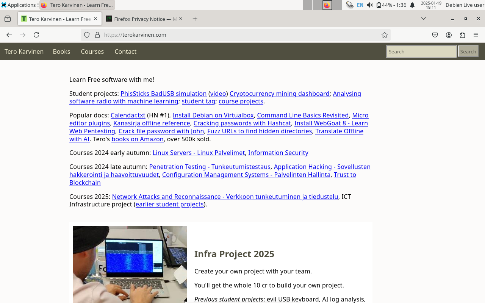
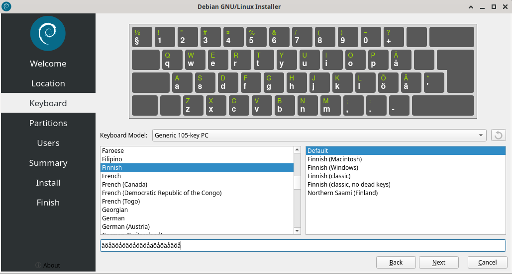

# Ensimmäinen kotitehtävä - Oma Linux

Tässä kotitehtävässä teen tiivistelmät annetuista artikkeleista ja asennan Linuxin virtuaalikoneeseen. Tehtävät tehdään kurssin opettajan antamien ohjeiden mukaan. (https://terokarvinen.com/linux-palvelimet/)

## Rauta

Lenovo 82SB  
AMD Ryzen 5 6600H with Radeon Graphics (12CPU)  
AMD RadeonT 660M  
NVIDIA GeForce RTX 3050 Ti Laptop GPU  
16 GB RAM  
Windows 11 Home 64-bit  

## Hyvän raportin alkeet

- Raportti pitää kirjoittaa niin että, toinen opiskelija pystyy toistamaan tehtävän samalla tavalla.
- Mitä teit ja mitä tapahtui.
- Kirjoitetaan raporttia samaan aikaan kun tehdään tehtävää.
- Raportti sähköisessä muodossa.
- Ympäristön yksityiskohdat tarkasti ylös (aika, paikka, laite yms.).
- Merkitään aikaleimat ja työvaiheiden kesto.
- Onnistumiset ja epäonnistumiset kirjataan, vikalista jos vikoja ilmenee.
- Tee raportista helppolukuinen.
- Lähdeviittaukset.
- Vältä pahoja mokia. Esim. plagiointia.

Tärkeää tuottaa tarkka ja selkeä raportti, jota voidaan hyödyntää uudestaan tulevaisuudessa, myös raportintekijä itse.

## FSF Free Software Definition

- "Free software" tarkoittaa ohjelmistoa, joka kunniottaa käyttäjän vapautta ja yhteisöä
- Käyttäjällä on vapaus käyttää, kopioida, levittää, opiskella, muokata ja parantaa ohjelmistoa.
- "Free" (vapaa) viittaa vapauteen, ei hintaan
- Voi olla kaupallista
- Ei pidä sekoittaa "open source" kanssa

### Neljä vapautta - The four essential freedoms

- Vapaus suorittaa ohjelmaa mille tahansa tarkoitukselle tai järjestelmälle ilman rajoituksia.
- Käyttäjä saa vapaasti opiskella ja ymmärtää, miten ohjelma toimii, ja muuttaa sitä omiin tarkoituksiin sopivaksi. Vaatii pääsyn lähdekoodiin.
- Vapaus kopioida ja jakaa ohjelmaa eteenpäin muiden auttamiseksi, joko ilmaiseksi tai maksua vastaan.
- Omien muokattujen versioden vapaa jakaminen, ilman että tarvitsee kertoa, että on ohjelmaa on muokattu. Vaatii pääsyn lähdekoodiin.

Kun nämä neljä vapautta löytyy ohjelmasta, niin voidaan ohjelma luokitella olevan "free software."

## Linuxin asentaminen koneelle

### Alkutietoja

Aloitin linuxin asentamis-tehtävän sunnuntaina 19.1.2025 klo 20.40. Olin aikaisemmin ladannut Oraclen VirtualBoxin "Johdanto ICT-infrastruktuuriin ja pilvipalveluihin" -kurssilla, mutta päivitin VirtualBoxin uuteen versioon VirtualBox-7.1.4. Aloitin päivityksen klo 20.42. Päivityksessä meni n. 2 minuuttia. VirtualBox päivitetty 20.44. Debian ISO imagen olin ladannut jo aikaisemmin viikolla tunnin jälkeen. Latasin debianin osoitteesta: https://cdimage.debian.org/debian-cd/current-live/amd64/iso-hybrid/, versio: debian-live-12.9.0-amd64-xfce.iso. 

Tehtävä tehdään kotona, Lenovon läppärillä, Windows 11.

## Linuxin asennus

Asennus aloitetaan klo 20.47 opettajan ohjeiden mukaan: https://terokarvinen.com/2021/install-debian-on-virtualbox/. Käynnistän VirtualBox Managerin. Expert Mode painaminen. 
- Nimen antaminen.
- ISO image: debian-live-12.9.0-amd64-xfce.iso.
- Type: Linux
- Version: Debian (64-bit)
- Skip Unattended Installation
- Hardware: Base Memory 4096MB, 4 prosessoria.
- Hard Disk: Create a Virtual Hard Disk Now, size: 60GB. Muuten kaikki default-vaihtoehdot.

Finish. Virtuaalikoneen luonti valmis 21.00.

### ISO-image

Asensin ISO-imagen jo edellisessä vaiheessa, joten se on Storage-kohdassa

### Virtuaalikoneen käynnistys

Kernelin käynnistys aloitetaan 21.02. Valitsen Live (amd64). Käynnistys valmistui 21.05, eli käynnistys kesti n. 3 minuuttia. Logeissa ei näyttänyt olevan ongelmia. Testi toimi oikein.

Ihmettelyn ja testailun jälkeen käynnistetään Debian GNU/Linux Installer 21.20.

### Installer

- American English -> Next
- Location: Region: Europe, Zone: Finland -> Next
- Keyboard Model: Generic 105-key PC Finnish ja Default. Kokeillaan tässä vaiheessa että näppäimistö toimii oikein. Jos toimii oikein niin -> Next

- Erase Disk: yes. (Poistaa kaiken turhan roskan virtuaalikoneelta). Encrypt: no. (koska virtuaalikone Boot loader location: Master Boot Record of VBOX HARDDISK -> Next
- Users: user-tiedot. Tärkeintä ettet laita "What is the name of this computer?" -kohtaan omaa, yrityksen tai tietokoneen tietoja, koska joissain verkoissa siitä tulee julkinen verkkotunnus ja sen pystyy näkemään
- Log in automatically: No -> Next
- Summary: paina install (jos nappia ei näy niin pistä installer koko ruudun näytölle niin nappi tulee esille).

Asennus aloitettu 21.47. Asennus valmis 21.53. Sitten "Restart Now": Yes, ja "Done"

Tämän jälkeen sain odottaa 21.59 asti että Login-ikkuna tuli esille. Sisäänkirjatuminen onnistui. Verkkosivustot toimivat ja niin toimii myös näppäimistö ja ääkköset.

## Lähteet:

Free Software Foundation (FSF). 2024. What is Free Software? https://www.gnu.org/philosophy/free-sw.html  
Tero Karvinen. 2025. Linux palvelimet 2025 alkukevät. https://terokarvinen.com/linux-palvelimet/  
Tero Karvinen. 2024. Install Debian on Virtualbox - Updated 2024. https://terokarvinen.com/2021/install-debian-on-virtualbox/  
Tero Karvinen. 2006. Raportin kirjoittaminen. https://terokarvinen.com/2006/raportin-kirjoittaminen-4/
