# h2 Komentaja Pingviini

## Tehtävänanto

Tiivistä artikkeli ranskalaisin viivoin

Asenna micro-editori ja kolme komentoriviohjelmaa.

Esittele tärkeät kansiot, jotka mainitaan artikkelissa.

Tee grep-komentoja.

Anna esimerkki putkituksesta.

Listaa laitteen rauta.

## Komentorivin alkeet

Tehtävänä on tiivistää artikkeli Linuxin komentorivin käskyjen alkeista. Artikkeli löytyy: https://terokarvinen.com/2020/command-line-basics-revisited/?fromSearch=command%20line%20basics%20revisited

- Komentoriville kirjoitetaan tekstiä, ns. komentoja, joiden avulla tehdään päivityksiä yms. koneelle.
- Komentorivi on helppo ja nopea käyttää.
- Ollaan aina hakemistossa. Hakemistojen välillä voi liikkua komennolla cd. Alempaan hakemistoon "cd hakemistonnimi" ja ylempään hakemistoon komennolla "cd ..".
- Uuden hakemiston voi luoda komennolla mkdir ja antamalla sille nimen. Esim. "mkdir uusikansio". Hakemiston voi poistaa komennolla rmdir.
- Komentoja voidaan putkittaa yhteen laittamalla | komentojen väliin. Esim. less|find.
- Komennot, jotka vaikuttavat koko järjestelmään tarvitsevat korkeat käyttöoikeudet. Nämä oikeudet ovat yleensä järjestelmän hallitsilla. Tällaisia komentoja ovat esim. ohjelmien asentaminen ja poistaminen, 
  uusien käyttäjien luominen ja oikeuksien antaminen
- Tällaisten komentoja voidaan tehdä komennolla sudo (Super User DO). Esim sudo apt-get y- install nethack-console (asentaa nethack pelin)

## Micro-tekstieditorin asentaminen

Asensin Micro-tekstieditorin jo tunnilla kun opettaja kertoi miten sen voi tehdä. Se onnistuu komennolla sudo apt-get install micro.

## Komentoriviohjelmien asennus

Avasin ensiksi terminaaliohjelman. Päivitin listan saatavilla olevista paketeista komennolla sudo apt-get update. Päivityksen jälkeen aloitin googlettamalla komentoriviohjelmia. Kolme, jotka herättivät 
mielenkiintoni olivat Guake, Nethack ja Googler. Käytin komentoa apt-cache search etsiäkseni kaikki kolme ohjelmaa nähdäkseni ovatko ohjelmat saatavilla. Esim. Guaken löytää komennolla apt-cache search guake.
Asensin kaikki kolme ohjelmaa komennolla sudo apt-get install guake nethack-console googler. Jos asennat monta ohjelmaa samalla kerralla niin voit asentaa ne kaikki yhdellä kerralla jos laitat ne kaikki
peräkkäin komentorivillä.

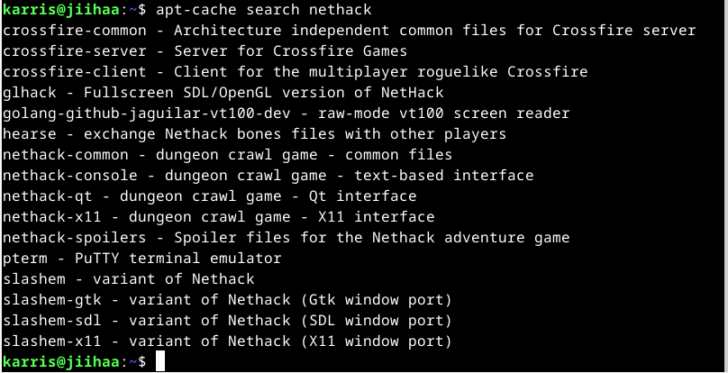
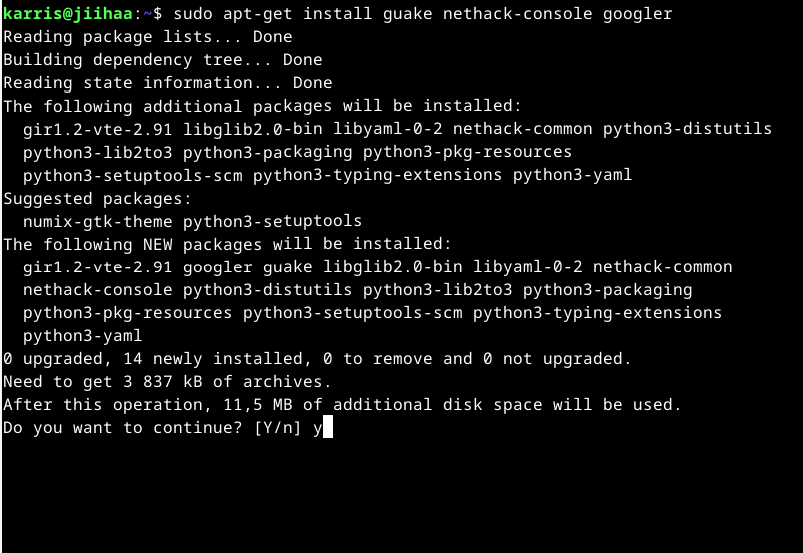

### Guake-terminaaliohjelma

Guake on terminaaliohjelma, minkä saat nopeasti käyttöön ja pois painamalla F12. Kiinnostuin Guakesta sen takia, koska nopeasti käyttöön ja pois saanti oli mielestäni hieno idea ja oikein käytettynä työskentelyä
nopauttava asia. Ohjelman asentamisen jälkeen, pistin sen päälle ja painoin F12 ja sain sen käyttöön. Tykkäsin ohjelmasta, koska sen käyttäminen oli nopeaa ja helppoa.
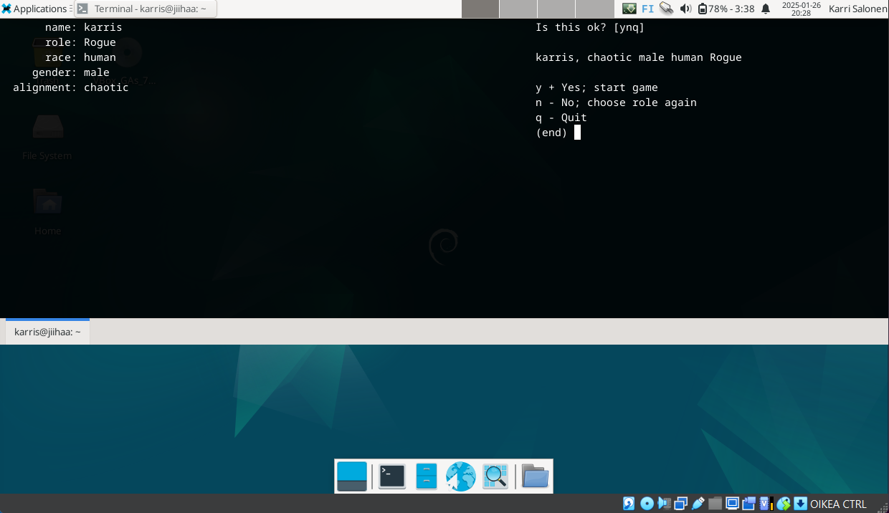

### Nethack-peli

Nethack on terminaalissa toimiva tekstipohjainen rpg-peli. Siinä luodaan hahmo, jolla seikkaillaan pelissä ja tapetaan hirviöitä. En oikein päässyt vielä peliin mukaan nopealla kokeilulla, mutta potentiaalia
pelistä löytyy ja pienellä harjoittelulla se on varmasti hauska ja koukuttava peli. Päätin pelata peliä Guakella, koska sain samalla myös enemmän miten Guake toimii.
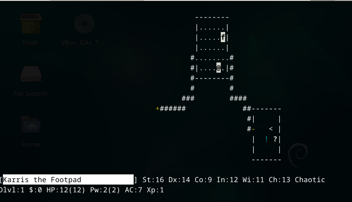

### Googler

Googler on komentorivillä toimiva Google-hakuohjelma. Asennuksen jälkeen, pistin ohjelman päälle ja sitten hakusanoilla etsin tietoa. Ohjelman sain toimimaan, mutta hakuja tehdessä en saanut yhtään vastauksia.
Idea hyvä, mutta lopputulos huono. En tiedä mikä vikana etteivät haut onnistuneet. Kuitenkin tykkäsin ajatuksesta että voin nopeasti hakea tietoa samalla kun työskentelen komentopäätteellä ilman että minun
tarvitsee poistua siitä.
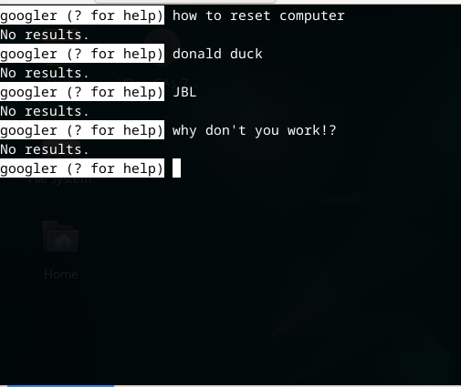

## Tärkeät kansiot

1. / (Root Directory) -  Juurikansio on tiedostojärjestelmän ylin taso, jossa kaikki muut kansiot sijaitsevat. 

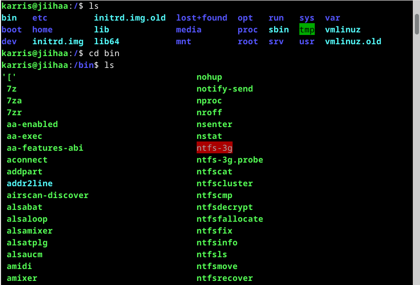

2. /home/ (Käyttäjien kotihakemistot) - Tässä kansiossa sijaitsevat kaikkien käyttäjien kotihakemistot.

3. /home/karris/ (Yksittäisen käyttäjän kotihakemisto) - Tämä on käyttäjän "karris" henkilökohtainen hakemisto. Sisältää esimerkiksi tiedoston Desktop-kansion, jossa on käyttäjän työpöytätiedostot.

4. /etc/ (Järjestelmän asetukset) - Sisältää järjestelmän asetustiedostot.

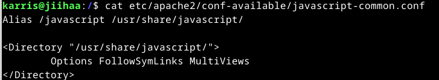

Esimerkki /etc/apache2/conf-available/javascript-common.conf, joka sisältää web-palvelimen asetukset

5. /media/ (Irrotettavat tallennustvälineet) - Hakemisto, johon liitetään esimerkiksi USB- tai CD-ROM -asemat.

6. /var/log/ (Järjestelmälokit) - Sisältää järjestelmän lokitiedostot, joita käytetään järjestelmän seurantaan ja virheiden selvittämiseen.

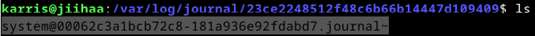

Esimerkki lokitekstistä

## Grep-komento

Grep-komennolla voidaan etsiä ja manipuloida tekstiä. Sitä käytetään laajalti ohjelmoijien ja käyttäjien joukossa, koska se on tehokas ja monipuolinen tapa käsitellä tekstidataa.
Grep-komennon syntax on 'grep [options] pattern [files].' Enemmän aiheesta: https://www.geeksforgeeks.org/grep-command-in-unixlinux/.

1. Lasketaan tietyn sanan määrä tekstitiedostossa.
grep -c "koira" koira.txt

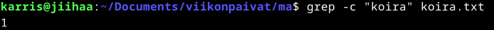

2. Näytetään rivi numero samalla kun näytetään tuloste.
grep -n "text" demo.txt

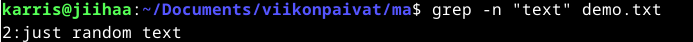

## Putkitus
Putkituksella tarkoitetaan sitä kun liitetään kaksi komentoa käyttämällä putkea (|-merkki).

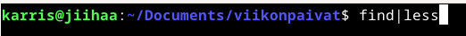

find|Less  
find listaa kaikki tiedostot ja hakemistot nykyisessä hakemistossa ja sen alihakemistoissa. Tuloste siirretään less-komennolle, joka näyttää listan selaamista varten.

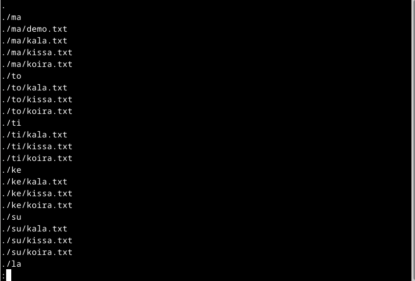

## Rauta

Minulla ei ole lshw ohjelmaa, joka näyttää koneeni tiedot, joten minun pitää ladata se ensiksi. Käytän hakukomentoa apt-cache search lshw, ja saan tulosteen, joka näyttää kaikki liitännäiset ohjelmat.
Lataan sudo ohjelman komennolla sudo apt-get install lshw. Haetaan koneen tiedot komennolla sudo lshw -short -sanitize (komento annettu tehtävänannossa (-sanitize poistaa henkilökohtaiset tiedot)). Järjestelmä pyytää
salasanaa ja sen annettuani saan koneen tiedot.

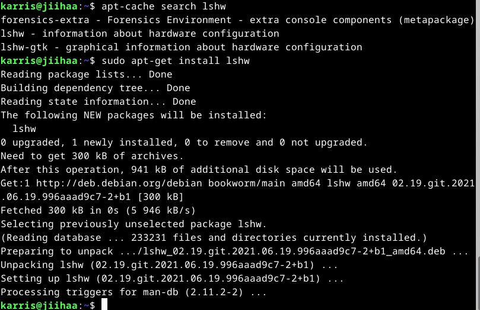

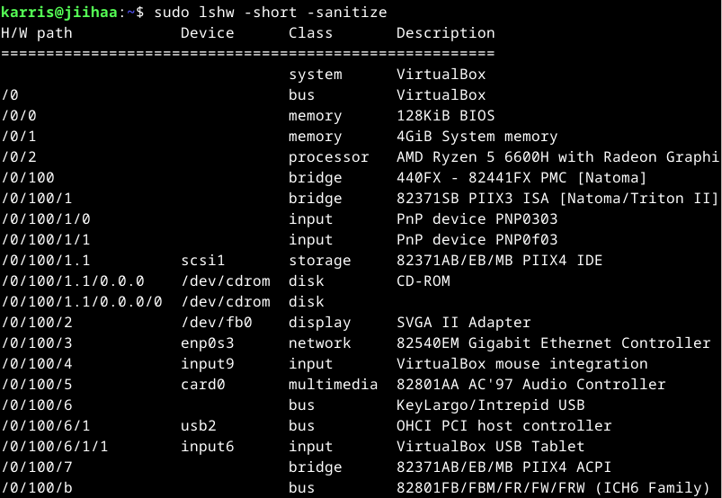
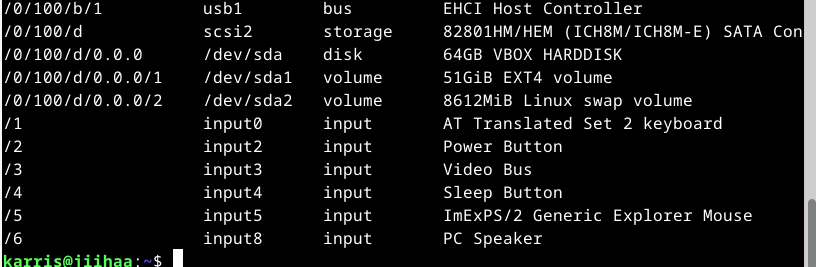

Järjestelmä:
- System: Virtuaalikone (VirtualBox).
- Bus: VirtualBoxin virtuaalinen emolevy.

Muisti:
- 128KiB BIOS: BIOSin koko.
- 4GiB System Memory: Virtuaalikoneelle on varattu4 GiB RAM-muistia.

Prosessori:
- AMD Ryzen 5 6600H with Radeon Graphics: isäntäjärjestelmän suorittimen malli.

Tallennus:
- /dev/cdrom: Virtuaalinen CD-ROM-asema.
- 82371AB/EB/MB PIIX4 IDE: IDE-ohjain tallennuslaitteille.

Näyttö:
- SVGA II Adapter: VirtualBoxin emuloitu näytönohjain

Verkkoyhteys
- 82540EM Gigabit Ethernet Controller: emuloitu verkkosovitin

Ääni:
- 82801AA AC'97 Audio Controller: VirtualBoxin emuloitu ääniohjain.

Syöttölaitteet:
- VirtualBox mouse integration: Hiiren integrointi virtuaalikoneeseen
- VirtualBox USB Tabler: virtuaalikoneen syöttölaite

Tallennus:
- SATA-tallenus:
  - Device: /dev/sda
    - Tämä on 64GT:n virtuaalinen kiintolevy
  - Volume: /dev/sda1
    - 51 GiB EXT4-tiedostojärjestelmä
  - Volume /dev/sda2
    - 8612 MiB swap virtuaalimuisti

USB-väylä
- EHCI Host Controller

## Lähteet:

Geeks for Geeks. 2024. grep command in Unix/Linux. https://www.geeksforgeeks.org/grep-command-in-unixlinux/  
Tero Karvinen. 2020. Command Line Basics Revisited. https://terokarvinen.com/2020/command-line-basics-revisited/?fromSearch=command%20line%20basics%20revisited  
Jack Wallen. 2024. 5 Linux terminal apps that are better than your default - and free to install. https://www.zdnet.com/article/5-linux-terminal-apps-that-are-better-than-your-default-and-free-to-install/  
Joey Sneddon. 2023. 10 Best Command Line Apps for Ubuntu. https://www.omgubuntu.co.uk/2021/11/best-command-line-tools-ubuntu-linux
