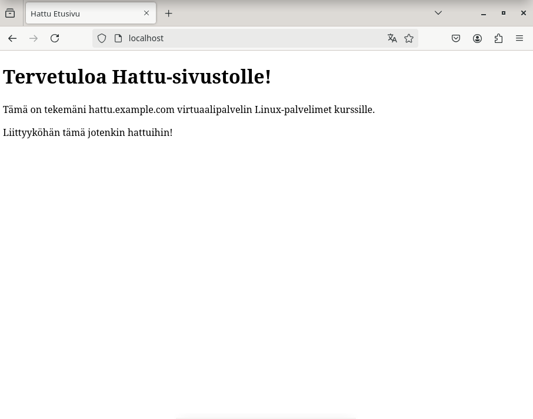

# h3 Hello Web Server

## Laitteisto

Lenovo 82SB  
AMD Ryzen 5 6600H with Radeon Graphics (12CPU)  
AMD RadeonT 660M  
NVIDIA GeForce RTX 3050 Ti Laptop GPU  
16 GB RAM  
Windows 11 Home 64-bit  

## Tehtävänanto

- Lue ja tiivistä artikkelit https://httpd.apache.org/docs/2.4/vhosts/name-based.html#page-header ja https://terokarvinen.com/2018/04/10/name-based-virtual-hosts-on-apache-multiple-websites-to-single-ip-address/
- Testaa että weppipalvelin vastaa localhost-osoitteessa. Asenna Apache-palvelin, jos sitä ei ole tehty.
- Etsi lokista rivit, jotka syntyvät. kun lataat omalta palvelimeltasi yhden sivun.
- Etusivu uusiksi. Tee uusi name based virtual host ja tee sille uusi etusivu. Pitää tehdä niin että sivua voi muokata ilman sudoa. Uusi sivu oltava hattu.example.com ja sen pitää näkuä asetustiedoston nimessä,
  asetustiedoston ServerName-muuttujassa asekä etusivun sisällössä.
- Validoi HTML5 sivu
- Anna esimerkit komennoista 'curl -I' ja 'curl'. Ja selitä muutama 'curl -I' otsakkeista.
- Vapaaehtoinen: Hanki GitHub Education -paketti.
- Vapaaehtoinen: Laita sama tietokone vastaamaan kahdella eri sivulla kashdesta eri nimestä.

## Artikkeleiden tiivistys

### Name-based Virtual Host Support

- "IP-based virtual hosting" tarvitsee IP-osoitteen määrittääkseen oikean virtuaalipalvelimen
- Näin ollen jokainen host tarvitsee oman IP-osoitteen
- "Name-based virtual hosting" on tekniikka, jonka avulla pystytään hallitsemaan montaa eri isännöintipalvelinta yhden IP-osoitteen alla.
- Nimiperusteinen hosting on yleensä yksinkertaisempaa, koska pitää vain määritellä DNS-palvelin, joka kartoittaa kaikki host-nimet oikeille IP-osoitteille.
- Sen jälkeen pitää konfiguroida Apachen HTTP palvelin, jotta se tunnistaisi eri host-nimet.
- IP-osoitteet ovat niukassa, joten tämä tekniikka helpottaa niiden tarvetta.
- Tätä tekniikkaa pitäisi käyttää silloin kun tarvikkeet eivät tarvitse selvästi omaa yksityistä IP-osoitteeseen perustuvaa hostingia.

#### How the server selects the proper name-based virtual host

- Name-based ratkaisu valitsee parhaan isännän vasta kun se on rajoittanut parhaat vaihtoehdot parhaista IP-osoitteisiin perustuvista isännistä.
- Villikortin (*) käyttö IP-osoitteseen tekee IP-osoitteiden kartoittamisesta turhaa.
- Kun pyyntö saapuu, palvelin etsii parhaan <VirtualHost> IP-osoitteen perusteella.
- Jos on monta sopivaa osoitetta, Apache vertaa ServerName ja ServerAlias direktiivejä palvelimennimeen, joka on annettu pyynnön mukana,
- Jos jätät antamatta ServerName:n, palvelin palaa oletus domain-nimeen, joka tulee systeemin host-nimestä. Tämä on huono tapa ja sitä ei rohkaista.

#### Using Name-Based Virtual Hosts

- Ensiksi pitää luoda <VirtualHost> -lohko jokaiselle eri hostille, joita haluat palvella.
- Jokaisen lohkon sisään pitää määritellä ServerName, joka kertoo mitä hostia palvellaan, ja DocumentRoot, joka näyttää, missä tiedostojärjestelmässä kyseisen hostin sisältö on.
- Jos haluat antaa tietyn IP-osoitteen, sen voi laittaa villikortin (*) tilalle <VirtualHost> asettaessa.
- Monet palvelimet haluavat olla saavutettavissa enemmälle kuin yhdelle nimelle, joten silloin pitää käyttää ServerAlias direktiiviä. Tähän voidaan listata ne nimet, jotka ovat niitä nimiä, millä ihmiset pääsevät sivuille.
- Sivut etsitään ensimmäisten määritelmien mukaan <VirtualHost>:ista, joten käytetään ensimmäisiä sopivia ServerName ja ServerAlias.
- Konfiguraatiota voi parantaa antamalla eri direktiivejä <VirtualHost> -konttiin. Direktiivit muuttuvat vain haluttujen sivujen osilta.

### Name Based Virtual Hosts on Apache - Multiple Websites to Single IP Address

- Useasti on niin että on vain yksi IP-osoite ja monta weppisivua hostattavana.
- Apachen avulla sinulla voi olla monta domain-nimeä yhdellä IP-osoitteella

#### Install Web Server
  
- Apache- weppipalvelimen asennus onnistuu komennolla 'sudo apt-get -y install apache2'

#### Add New Name Based Virtual Host

- Luodaan uusi konfiguraatio-tiedosto weppisivua varten apacheen komennolla 'sudoedit /etc/apache2/sites-available/pyora.example.com.conf'
- Annetaan tiedostoon oikeat tiedot:
  esim.  
<VirtualHost *:80>  
 ServerName pyora.example.com  
 ServerAlias www.pyora.example.com  
 DocumentRoot /home/xubuntu/publicsites/pyora.example.com  
 <Directory /home/xubuntu/publicsites/pyora.example.com>  
   Require all granted  
  < /Directory>  
  < /VirtualHost>

- Aktivoi sivusto komennolla 'sudo a2ensite pyora.example.com'
- Käynnistä apache-palvelin uudestaan komennolla 'sudo systemctl restart apache2'

#### Create Web Page as a Normal User

- Luodaan uusi kansio weppisivua varten komennolla 'mkdir /home/xubuntu/publicsites/pyora.example.com/'
- Luodaan etusivu weppisivulle komennolla 'echo pyora > /home/xubuntu/publicsites/pyora.example.com/index.html'

#### Test

- Varmistetaan että localhost antaa meidän sivumme kun kutsumme sitä komennolla 'curl -H 'Host: esimerkki.example.com' localhost'
- Toinen komento millä voi testata weppisivun toimintaa on komennolla 'curl localhost'

## Weppipalvelimen testaus localhost-osoitteessa

Olin asentanut Apache2-weppipalvelimen maanantain tunnilla tuntitehtävän aikana. Testaan weppipalvelimeni localhost-sivua klo 16.56. Se toimii oikein.

## Lokien analysointi

Minun pitää selvittää Apachen lokit kun lataan yhden sivun palvelimelta. Tein sen komennolla 'sudo tail /var/log/apache2/access.log'.
Tulostui kolme (3) riviä lokitietoja. Tulostukseen meni silmänräpäys.

  

Rivi 1:

- 127.0.0.1 - IP-osoite, joka teki pyynnön. Pyyntö tuli localhostista eli omalta koneeltani.
- Ensimmäisen viivan (-) kohdalle tulee clientin tiedot, joka tehnyt pyynnön sivusta. Rivi näkyy usein viivana ja tähän riviin ei kannata aina luottaa, paitsi hyvin kontroloidussa sisäisessä verkossa.
- Toinen viiva (-) kertoo kuka käyttäjä (userId) on tehnyt pyynnön sivusta.
- 02/Feb/2025:17:00:45 +0200 - kertoo ajan ja päivämäärän milloin pyyntö tehty. 02 päivä, Feb kuukausi, 2025 vuosi, 17 tunti, 00 minuutti, 45 sekunnit, +0200 kertoo että aika on 2 tuntia edelle GMT.
- GET / HTTP/1.1 - selaimen pyynnön tyyppi: GET - sivu on haettu ja lähetetty bodyyn oikein. "/" - index-sivu haettu. HTTP-protokolla on 1.1.
- 200 - Status koodi. Kaikki OK.
- 3380 - Ladatun tiedon koko tavuina.
- viiva (-) tarkoittaa ettei tullut muulta sivulta kyseiselle sivulle. Olen siis kirjoittanut sivun suoraan selaimeen.
- Mozilla/5.0 (X11; Linux x86_64; rv:128.0) Gecko/20100101 Firefox/128.0  - User-Agent tieto. Kertoo selaimen ja käyttöjärjestelmän tiedot. Selain on Mozilla Firefox, graafinen käyttöliittymä X11 (X Windows System), käyttöjärjestelmä Linux 64-bittinen, Firefox versio 128.0, Gecko on Firefoxin renderointimoottori, 20100101 on staattinen numero.

Rivi 2:

- GET /icons/openlogo-75.png - Haettu ja lähetetty openlogo-75.png kuva bodyyn.
- http://localhost - Tultu omalta localhost sivulta tähän.

Rivi 3:

- GET /favicon.ico - Haettu ja lähetetty favicon.ico iconia.
- 404 - Pyydettyä resurssia ei löytynyt

## Etusivu uusiksi

Tehdään uusi name based virtual host ja etusivu uusiksi. Uusi sivu on hattu.example.com. Aloitan tehtävän 19.25. Teen sivun https://terokarvinen.com/2018/name-based-virtual-hosts-on-apache-multiple-websites-to-single-ip-address/ ohjeiden mukaisesti.
Ensiksi luon hattu.example.com konfiguraatio-tiedoston komennolla sudoedit /etc/apache2/sites-available/hattu.example.com.conf ja syötän sinne < VirtualHost> -lohkoon tarvittavat tiedot. Kirjoitan raporttia samalla kuin teen tehtävää, joten teen tämän aikaan 19.30.
Pyytää käyttäjän salasanaa ja annan sen. 

  

Tallennan tiedoston ctrl+S ja poistun ctrl+X  

Tarkistetaan 'sudo cat /etc/apache2/sites-available/hattu.example.com.conf' -komennolla että tiedosto on kirjoitettu oikein. Kaikki OK. Aika 19.38.

  

Seuraavaksi poistetaan vanhat sivustot käytöstä ja pistetään uusi hattu.example.com sivu käyntiin. Sivun sää päälle komennolla 'sudo a2ensite hattu.example.com' ja vanhat sivut saa pois komenolla 'sudo a2dissite'. 
Näiden komentojen jälkeen pitää apache2 käynnistää uudestaan komennolla 'sudo systemctl restart apache2'

  

Seuraavaksi luon uuden etusivun weppipalvelimelleni. Nimetään se index.html. Aloitan teon 19.48.
Ensiksi siirryn public-sites -kansiooni komennolla 'cd public-sites' ja siellä luon uuden hakemiston/kansion komennolla 'mkdir hattu.example.com'. Kansion luonnin jälkeen siirrytään kansioon komennolla 'cd hattu.exapmle.com' ja luon sinne etusivun 'index.html' micro-editorin avulla.

  

  

Tallensin sivun ctrl+S ja poistuin ctrl+Q. Tarkistetaan vielä cat-komennolla että index.html -tiedostossa on oikea tieto.

  

Kokeillaan nyt toimiiko weppisivu selaimessa. Mennään localhostiin.

  

Sivu toimii oikein selaimessa. Selvitetään vielä onko käyttäjällä oikeidet muokata tiedostoa ilman sudoa. Annan komennon 'micro /home/karris/public-sites/hattu.example.com/index.html'.
Micro-editori aukeaa ja pystyn muokkaamaan sivua ilman sudoa. Katsotaan vielä käyttäjän oikeudet komennolla 'ls -l /home/karris/public-sites/hattu.example.com/index.html'.
Näyttäisi siltä että oikeudet kunnossa.

  

- Kohta -rw- kertoo että käyttäjällä 'karris' on read&write oikeudet eli voi lukea ja muokata. Muilla käyttäjillä vain lukuoikeudet.

## Sivun validointi

Validoidaan index.html-sivu https://validator.w3.org sivulla. Etusivulla menin kohtaan 'Validate by File Upload' ja 'Browse.' Hakeuduin sen jälkeen public-sites kansioon, mistä menin hattu.example.com ja valitsin sieltä index.html -sivun. Sen jälkeen painoin 'Check' -nappia. 

  

Sivu on validi eikä virheitä ole.

## Curl-komentoja

Tehdään curl-komentoja. Ensimmäiseksi pelkkä 'curl localhost'. Curl-komento näyttää sivun sisällön komentorivillä.

  

Seuraavaksi pitää tehdä komento 'curl -I" teen sen myös localhost-sivulle. Komento 'curl -I' antaa tiedoston tiedot otsakkeina (response header).

  

- HTTP/1.1 200 OK: HTTP protokolla ja status 200 OK. Pyyntö onnistunut.
- Date: näyttää päivän ja ajan milloin palvelin loi vastauksen
- Server: palvelimen tiedot.
- Last-Modified: aika milloin tiedoston sisältöä on viimeksi muokattu.
- Etag: Tunniste.

## GitHub Education

En saanut hankittua GitHub Education -pakettia kun sivusto ei hyväksynyt hakemustani. Pitää selvittää myöhemmin miten se onnistuu.

## Kahden eri sivun hostaaminen

Hostataan kaksi eri sivua saman IP-osoitteen alla. Käytän hattu.example.com ja karri.example.com -sivuja. Hostaaminen onnistuu ohjeiden mukaan hosts-tiedoston avulla. Ne löytyvät /etc/-hakemistosta.
Tarkemmin se on '/etc/hosts'. Artikkelin https://terokarvinen.com/2018/04/10/name-based-virtual-hosts-on-apache-multiple-websites-to-single-ip-address/ lopussa mainitaan nopeasti tämä kohta. Mennään juurihakemistoon /home/karris/ -hakemistosta. 
Kaksi kertaa peräkkäin komento 'cd ..' ja ollaan juurihakemistossa. Sen jälkeen 'cd etc/' ja sitten voidaankin katsoa nopeasti mitä hosts kansiosta löytyy cat-komennolla.

  

Sieltä löytyy palvelimen host-osoitteet. Sitten kirjoitetaan sinne IP-osoitteet ja weppisivut hattu.example.com ja karri.example.com. Komento 'sudo micro hosts' avaa tekstieditorin, jotta pääsen editoimaan tiedostoa.

Sitten pistetään karri.example.com päälle komennolla 'sudo a2ensite karri.example.com'. Sen jälkeen Apachen uudelleenkäynnistys 'sudo systemctl restart apache2.' Tämän jälkeen sivut ovat toiminnassa samalla IP-osoitteella, 
mutta molemmat toimivat omalla nimellään. Tarkistetaan vielä selaimesta.

Kaikkien tehtävien tekemiseen meni noin 2-3 tuntia raporttia samalla kirjoittaen ja taukoja pidellen.

## Lähteet:

Apache. 2025. Name-based Virtual Host Support. https://httpd.apache.org/docs/2.4/vhosts/name-based.html#page-header  
Tero Karvinen. 2025. Linux Palvelimet 2025 alkukevät. https://terokarvinen.com/linux-palvelimet/  
Karvinen, Tero. 2018. Name Based Virtual Hosts on Apache - Multiple Websites to Single IP Address. https://terokarvinen.com/2018/04/10/name-based-virtual-hosts-on-apache-multiple-websites-to-single-ip-address/  
Baeldung. 2024. What Is X11? https://www.baeldung.com/linux/x11  
Sumo Logic. 2020. Understanding the Apache Access Log: View, Locate and Analyze. https://www.sumologic.com/blog/apache-access-log/  
Sematext. 2021. Understanding Apache Logging: How to View, Locate and Analyze Access & Error Logs. https://sematext.com/blog/apache-logs/  
MDN Web Docs. 2024. HTTP respinse status codes. https://developer.mozilla.org/en-US/docs/Web/HTTP/Status#successful_responses  
http.dev. 2023. HTTP/1.1. https://http.dev/1.1  
MDN Web Docs. 2024. User-Agent. https://developer.mozilla.org/en-US/docs/Web/HTTP/Headers/User-Agent  
How-To Geek. 2016. What Is a Browser's User Agent. https://www.howtogeek.com/114937/htg-explains-whats-a-browser-user-agent/  
Geeks fo Geeks. 2024. HTTP headers. https://www.geeksforgeeks.org/http-headers/  
