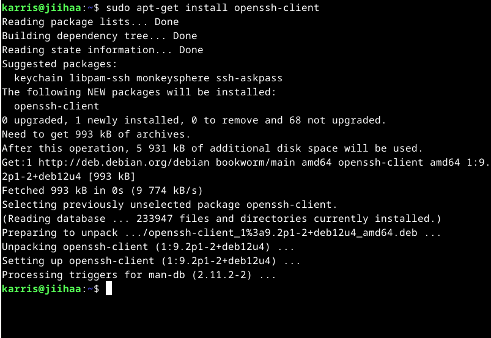

# h4 Maailma kuulee

## Laitteisto

Lenovo 82SB  
AMD Ryzen 5 6600H with Radeon Graphics (12CPU)  
AMD RadeonT 660M  
NVIDIA GeForce RTX 3050 Ti Laptop GPU  
16 GB RAM  
Linux Debian 12  

## Tehtävänanto
- x) Lue ja tiivistä. Tiivistelmäksi riittää muutama ranskalainen viiva per artikkeli. (Tässä alakohdassa ei tarvitse tehdä testejä tietokoneella)
  - Susanna Lehto 2022: Teoriasta käytäntöön pilvipalvelimen avulla (h4) (opiskelijan esimerkkiraportti), kohdat
    - a) Pilvipalvelimen vuokraus ja asennus
    - d) Palvelin suojaan palomuurilla
    - e) Kotisivut palvelimelle
    - f) Palvelimen ohjelmien päivitys
  - Karvinen 2012: First Steps on a New Virtual Private Server – an Example on DigitalOcean and Ubuntu 16.04 LTS

- a) Vuokraa oma virtuaalipalvelin haluamaltasi palveluntarjoajalta. (Vaihtoehtona voit käyttää ilmaista kokeilujaksoa, GitHub Education krediittejä; tai jos mikään muu ei onnistu, voit kokeilla ilmaiseksi vagrant:ia paikallisesti. Suosittelen kuitenkin harjoittelemaan oikeilla, tuotantoon kelpaavilla julkisilla palveluilla).
- b) Tee alkutoimet omalla virtuaalipalvelimellasi: tulimuuri päälle, root-tunnus kiinni, ohjelmien päivitys.
- c) Asenna weppipalvelin omalle virtuaalipalvelimellesi. Korvaa testisivu. Kokeile, että se näkyy julkisesti. Kokeile myös eri koneelta, esim kännykältä. (Jos haluat tehdä oikeat weppisivut, tarvitset Name Based Virtual Hostin)

## Artikkelien tiivistäminen

### Teoriasta käytäntöön pilvipalvelimen avulla (h4)

#### a) Pilvipalvelimen vuokraus ja asennus
- Käyttäjä hyödynsi GitHub Educationin pakettia "GitHub Student Developer Pack" saadakseen ilmaisen palvelimen ja domainnimen käyttöönsä. Tästä syystä hankki palvelimen DigitalOceanilta ja domainin Namecheapiltä.
- Rekisteröityy käyttäjäksi suoraan digitalocean.com -sivuilta.
- Syöttää maksutiedot, tunnistautuu ja tunnistautumisen jälkeen pääsee käyttäjän etusivulle. Menee Billing -sivulle, josta löytyy kohta GitHub Educationin alekoodille. Asettaa myös Billing -sivulta "Billing alerts" -kohdasta maksuhälytyksen, jotta muistaa poistaa DO:n käytöstä.
- Droplets -sivulta hankitaan virtuaalipalvelin.
- Luo Debian 11 -pohjaisen virtuaalikoneen Intelin prosessorilla, jossa 1GB RAM, 25GB SSD-kovalevy ja 1000GB siirtodataa. Hinta 5$/kk.
- Saatavilla olevista datakeskuksista valitsee Amsterdamin, koska se on lähimpänä ja ajattelee myös GDPR:n vaatimuksia.
- Valitsi vahvan salasanan SSH-avaimen sijaan. Mainitsee että SSH olisi turvallisempi vaihtoehto.
- Vuokraa domainnimen GitHubin alennuskoodia käyttäen Namecheapistä. Käyttäjäksi rekisteröitymisessä oli useita ongelmia, mutta ne ratkesivat ja onnistui rekisteröitymisessä.
- Rekisteröitymisen jälkeen yhdistää GitHub-tilinsä Namecheap -tiliin. Ohjaa domainnimen osoittamaan DO:lta hankitulle virtuaalipalvelimelle. Domain List -sivulta domainnimensä hallintanapin kautta poistaa turhia tiedostoja ja lisää uuden tiedoston, mihin lisää virtuaalipalvelimensa IP-osoitteen. Sen jälkeen domain ja virtuaalipalvelin ovat yhteydessä.

#### d) Palvelin suojaan palomuurilla
- Käyttäjä avaa depianinsa terminaalin ja ottaa SSH-yhteyden virtuaalipalvelimeen.
- Sisäänkirjautumisen jälkeen päivittää järjestelmän update komennolla.
- Asentaa palomuurin, tekee siihen reiän ja ottaa palomuurin käyttöön.
- Virtuaalipalvein suojattiin palomuurilla onnistuneesti.

#### e) Kotisivut palvelimelle
- Luodaan uusi käyttäjä ja määritetään sen oikeudet.
- Lukitaan root-käyttäjä.
- Järjestelmä päivitetään ja Apache-palvelin asennetaan.
- Konfiguroidaan palomuuri ja korvataan testisivu omalla sivulla.
- Onnistuneen testauksen jälkeen sivut saadaan näkymään julkisesti.

#### f) Palvelimen ohjelmien asennus
- Ohjelmien ja järjestelmän päivitys SSH-yhteydessä.
- Päivitykset tarkistetaan, ohjelmat päivitetään ja tietoturvapäivityskin tehdään.

### First Steps on a New Virtual Private Server - an Example on DigitalOcean and Ubuntu 16.04 LTS
- Ohjeita uuden virtuaalipalvelimen asennukseen DigitalOceanissa ja DNS-nimen määrittäminen Namecheapissä. Suositellaan GitHub Education paketin hankintaa ilmaisten resurssien takia.
- Virtuaalipalvelimen luonti. Luo tili, lisää maksutapa ja luo palvelin. Valitse datakeskus kirjaudu sisään root käyttäjänä. Aseta vahva salasana.
- Konfiguroi palomuuri
- Luo käyttäjätili ja aseta oikeudet. Testaa käyttäjätunnukset ennen kuin suljet rootin. Sulje root-käyttäjä.
- Päivitä järjestelmä ja ota palvelin käyttöön.
- Määritä DNS-nimi Namecheapissä. Apache-palvelimen asennuksen jälkeen määritä verkkotunnus. Lisää uusi "A record" ja testaa toimivuus.
- Virtuaalipalvelin asennettu, suojattu ja valmis käytettäväksi.

## Oman virtuaalipalvelimen vuokraaminen

Aloitin tehtävän tekemisen lauantaina 8.2. klo 16.45.  
Päätin vuokrata virtuaalipalvelimen UpCloudista (www.upcloud.com) koska olimme tunnilla nähneet esimerkin miten se onnistui tästä palvelusta. Aivan ensimmäiseksi piti rekisteröityä. Annoin nimeni ja sähköpostiosoitteen. Sitten klikkasin "I'm not a robot" ja "Get Started".
Sitten piti antaa maksutiedot, johon syötin pankkikorttini tiedot. Lopuksi vielä piti tehdä 0€ verkkopankkimaksu, jonka avulla sivusto varmistaa henkilöllisyyden. Rekisteröityminen onnistuu ja pääsen kirjautumaan sisään.

Sitten painoin "Deploy Now". Valitsin lokaatioksi FI-HEL1, koska halusin että se on mahdollisimman lähellä minua ja EU:n sisällä niin tämä vaikutti parhaalta vaihtoehdolta. Sitten Plan: Developer ja ylin vaihtoehto, joka maksoi vähiten ja siinä oli 1 CPU, 1GB memory ja 10GB storage.
Annoin storage- ja automated backups -kohtien olla oletukset. Valitsin "Operating System" kohdassa Bookwormin eli Debian CNU/Linyx 12. Login Method valitsen SSH Keys ja painan "Add New" -nappia. Seuraavaksi pitää luoda SSH-avain.

  

  

SSH-avaimen luominen onnistuu terminaalista. Avaan terminaalin ja päivitän ohjelmat: 'sudo apt-get update'. Päivityksen jälkeen asennan SSH-ohjelman, koska tiedän ettei minulla ole sitä asennettuna. Se asentuu komennolla 'sudo apt-get install openssh-client'. Ohjelman asennus onnistuu vaikeuksitta.
Sitten on aika luoda SSH-avain. Teen sen komennolla ssh-keygen. Kolme kertaa kysytään lisätietoja, mutta painan vain enteriä päästäkseni eteenpäin. Nyt SSH-avain on luotu. 

Pääsen siihen käsiksi menemällä kansioon '.ssh'. Kansiossa käytän micro-editoria, jotta pystyn lukemaan ja kopioimaan avaimen. Avaan micro editoriin tiedoston 'id_rsa.pub'.
Tästä tiedostosta löytyy julkinen avaimeni, jonka kopioin ja sitten liitän sen UpCloud-sivulla SSH Key kenttään. Nimeän avaimen "korkki". Sitten tallennan avaimen. 

Lopuksi otan vain yhden serverin ja painan "Deploy"-nappia. Tämän jälkeen menee hetki kun virtuaalipalvelin otetaan käyttöön. 

Kun palvelin on valmis painan oikeasta yläkulmasta kohtaa "See how to connect" ja seuraavasta kohdasta "from Linux" ja saan ohjeet kuinka saan yhdistettyä virtuaalipalvelimen Linuxiini. Nyt oman virtuaalipalvelimen vuokraus on tehty. 

Osio oli valmis klo 17.15.

## Alkutoimien tekeminen omalle virtuaalipalvelimelle

Jatkoin tehtävien tekemistä sunnuntaina 9.2. klo 17.53.  

Kirjaudun Root-käyttäjälle UpCloudin ohjeiden mukaisesti. Voin tehdä sen heti, koska SSH ohjelma on jo ladattu. Kirjautuminen onnistuu komennolla 'ssh root@PALVELIMEN_IP-OSOITE'

Sen jälkeen lisään uuden sudo-käyttäjän.
- sudo adduser karri
- Annan nimeni ja muut tiedot jätän tyhjiksi

Lisään käyttäjän sudo-ryhmään
- sudo adduser karri sudo

Kopioin root:n ssh-asetukset käyttäjälle karri
- sudo cp -rvn /root/.ssh/ /home/karri/
- sudo chown -R karri:karri /home/karri/ (vaihtaa hakemistojen omistajaksi karri-käyttäjän)

Asennetaan palomuuri ja tehdään siihen reikä niin että dataa pääsee kulkemaan sen läpi. Palomuuria ei löydy, joten asennetaan se.
- sudo apt-get install ufw

Tehdään palomuuriin reikä.
- sudo ufw allow 22/tcp

Ja sitten palomuuri päälle
- sudo ufw enable

Palataan paikalliselle koneelle exit -komennolla. Sitten kirjaudutaan käyttäjällä 'karri'. Sisäänkirjautuminen onnistuu ongelmitta.

Lukitaan root-käyttäjä ja uudelleennimetään kansio
- sudo usermod --lock root
- sudo mv -nv /root/.ssh/ /root/DISABLED-ssh

Lukitus onnistuu ja root-käyttäjällä ei pysty enää kirjautumaan sisään.  
Lopuksi päivitetään ohjelmat.
- sudo apt-get update
- sudo apt-get dist-upgrade

Nyt virtuaalipalvelimen alkuvalmistelut on tehty. Valmis klo 18.30.

## Webbipalvelimen asennus virtuaalipalvelimelle.

Asennetaan Apache-webbipalvelin virtuaalipalvelimelle.
- sudo apt-get install apache2

Tehdään Apachelle reikä palomuuriin
- sudo ufw allow 80/tcp

Tarkastetaan että palvelin toimii oikein. Menen selaimeen ja syötän virtuaalipalvelimen ip-osoitteen. Saan apachen default-sivun. Webbipalvelin siis toimii oikein. Tarkistin vielä että se toimii muualla laitteella, joten testasin sivua
kännykällä ja sivu toimi oikein. Lopuksi korvasin testisivun.
- echo "Default"|sudo tee /var/www/html/index.html

Päivitän varmuuden vuoksi apachen
- sudo systemctl restart apache2

Sivulla näkyy nyt pelkkä "Default" -sana.

Tehtävä valmis 18.35.

