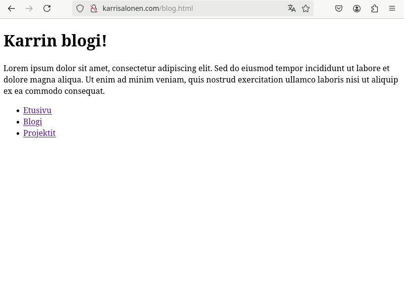

# h5 Nimekäs

## Rauta

Lenovo 82SB  
AMD Ryzen 5 6600H with Radeon Graphics (12CPU)  
AMD RadeonT 660M  
NVIDIA GeForce RTX 3050 Ti Laptop GPU  
16 GB RAM  
Windows 11 Home 64-bit  

## Tehtävänanto

Tehtävä tehdään opettajan antamien ohjeiden mukaisesti. https://terokarvinen.com/linux-palvelimet/

## a) Nimi

Hankitaan domainnimi kurssilla tehdylle virtuaalipalvelimelle. Domainnimi on webbiosoite, joka laitetaan selaimeen, jotta päästään tietylle sivulle. Se on helpompi muistaa kuin IP-osoite, sekä se tuo yritykselle/sivustolle luotettavuutta
Domainnimen hankin NameCheap-nimisestä nimipalvelusta. 

Menen sivuille ja aloitan rekisteröitymisen sign up -kohdasta. Pitää keksiä käyttäjänimi ja salasana, sekä antaa omat nimitiedot ja sähköpostiosoite. Kun rekisteröinti on tehty etsin omalla nimelläni domainnimeä. Sieltä löytyy monta erilaista. Valitsen karrisalonen.com. 

Menen ostoskoriin ja aloitan ostoprosessin. Minun pitää syöttää maksutietoja ja osoitteeni. Myös pitää päättää mitä palveluja haluaa, jos haluaa lisäpalveluja. Menin oletuksilla.

Kun domainnimi oli ostettu. Siirryin DNS-tietojen konfigurointiin. Menen vasemmalla olevasta "ukon"-kuvasta My Account osioon ja sieltä valitsen kohdan dashboard. Sivulla on heti kohta 'Recently active in Your Account' ja siinä näkyy domainnimeni. Domainnimen
oikealla puolella on nappi 'Manage'. 

Painan sitä ja sivu siirtyy välilehteen 'Domain List'. Valitsen kohdan 'Advanced DNS' ja sieltä pääsen määrittelemään a-tietueet niin että saan yhdistettyä domainnimeni virtuaalipalvelimeni IP-osoitteeseen.
'Host Records' kohdassa on kaksi tietuetta, jotka poistan. 

Sen jälkeen lisään uuden a-tietueen punaisesta napista 'Add Record'. Laitan 'Host' kohtaan @ ja 'Value' kohtaan virtuaalipalvelimen IP-osoitteen ja lisätäkseni tietueen hyväksyn sen vihreästä check-merkistä oikealla.
Lisään vielä toisen tietueen. 'Host' kohtaan www ja 'Value' taas IP-osoite. Molempiin laitan vielä TTL 5 min, jotta sivu päivittyy nopeasti. TTL tarkoittaa Time To Live, ja määrittää kuinka kauan tietue tallennetaan välimuistiin palvelimella ennen kuin se kysyy uusia tietoja.

Nyt kun tietueet on lisätty testaan että ne ovat oikein linkitetty palvelimelle ja kokeilen että sivu toimii karrisalonen.com - ja sehän toimii!

## b) Based

Seuraavaksi pitää tehdä nimipohjainen virtuaalipalvelin näkymään uudesta domainnimestäni. Käytän ssh:ta luomaan etäyhteyden palvelimelleni. Menen apachen tietoihin komennolla 'cd /etc/apache2/', sen jälkeen siirryn vielä hakemistoon 'sites-available.' 

Sen jälkeen luon virtualhostilleni konfiguraatio-tiedoston.

sudoedit karrisalonen.com.conf. 

Syötän sinne VirtualHost tiedot. Kun luonut konfiguraatio-tiedoston, pistän sen päälle komennolla

sudo a2ensite karrisalonen.com 

ja potkaisen webbipalvelinta komennolla

sudo systemctl restart apache2 

Seuraavaksi menen /home/karri/ -hakemistoon ja luon uuden hakemiston 'mkdir public-sites'. Siirryn hakemistoon ja luon sinne hakemiston 'mkdir karrisalonen.com.' ja sen jälkeen siirryn sinne ja luon index.html -tiedoston micro-edirotia käyttämällä. En ole näköjään vielä asentanut microa. Se onnistuu 'sudo apt-get install micro'
Nyt pystyn luomaan index.html -tiedoston. Annan komennon 'micro index.html' ja teen sinne simppelin etusivun.

Potkaistaan taas apachea, jotta webbipalvelimen tiedot päivittyisivät nyt kun olen tehnyt virtualhostin konfiguraatiot. Kokeilen toimiiko nettisivu ja sehän ei toimi. 

Katsotaan apachen error.logista mitä on vikana.

sudo tail /var/log/apache2/error.log/

Näyttäisi siltä että apache ei pääse nettisivuun käsiksi. Menen /home/karri/ ja annan komennon 'sudo chmod o+x karri' mutta näköjään hakemistoa karri ei löydy. 

No siirryn ylemmäs home-hakemistoon ja annan saman komennon uudestaan. Nyt homma toimii.
Tarkastelen 'ls -l' -komennolla mitä oikeuksia kaikilla on. 

Päätän antaa execute oikeuden kaikille, joten annan 'sudo chmod ugo+x karri' -komennon ja nyt se on varmasti kaikille oikeutena. Chmod antaa oikeudet hakimostolle ja kaikille sen alahakemistoille. 

Päivitän verkkosivun ja nyt se toimii niin kuin pitää.

## Kotisivu

Etusivun lisäksi pitää luoda vielä kaksi sivua lisää palvelimelle. Avaan micro-editorilla index.html -sivun ja lisään sinne navigointi osion. 

Sen jälkeen käytän copy-komentoa kopioidakseni etusivun tiedot kahdelle muulle html-sivulle. Nimeän ne Blog ja Projects.

cp index.html blog.html ja cp index.html projects.html.

Nyt etusivu on kopioitu ja kaksi uutta html-sivua luotu. Nyt käyn nopeasti micro-editorin avulla muuttamassa näiden sivujen tiedot sopiviksi ja erilaiseksi etusivusta. 

Sen jälkeen potkaisen webbipalvelimelle päivityksen. Päivitetään sivut selaimessa ja sivut toimivat oikein.

## Alidomain

Menen takaisin NameCheapin sivuille ja päivitän siellä Domain List Advanced DNS asetuksissa kaksi uutta a-tietuetta. Laitan niille 'Host' kohtaan 'kurssi' ja 'blog' nimet ja 'Value' kohtaan taas IP-osoite.

Tämän jälkeen syötän uudet virtualhost -konfigutaariot karrisalonen.com.conf -tiedostoon.

Tarkistan että kongigurointi syntaxia on kunnossa.

Kun tiedot on lisätty potkaisen taas apachea ja käyn tarkatamassa sivut. Nyt nettisivut toimivat myös blog.karrisalonen.com ja kurssi.karrisalonen.com sivujen kautta.

## Host & Dig

Host ja Dig ovat työkaluja, joiden avulla pystytään tarkastamaan komentorivillä nettisivujen DNS-tietoja. Minulle ei ole kumpaakaan asennettuna, joten asennan ne. 

  
sudo apt-get install host  

  
sudo apt-get install dnsutils

Sen jälkeen teen kyselyt omalle sivulleni karrisalonen.com, pienelle yrityksen sivulle fataliiseeds.net ja suuren yrityksen sivuille google.com.
Host-työkalu kertoo tiiviimmin asioita. Se kertoo nettisivun IP-osoitteen sekä erilaisia sähköpostipalvelimia ja niitten priotiteetit. Dig kertoo paljon enemmän tietoja nettisivusta.

Dig kertoo, että kysytään a-tietuetta karrisalonen.com (QUESTION SECTION), ja saa vastauksen (ANSWER SECTION) karrisalonen.com -verkkotunnus ohjaa IP-osoitteeseen 80.69.174.220. Ja TTL on 183 sekunttia.  
Query Time kertoo kuinka nopeasti kysely onnistui.  
SERVER näyttää DNS-palvelimen IP-osoitteen, joka vastasi kyselyyn.  
MSG SIZE kertoo, kuinka suuri vastaanotettu viesti oli.

Jos käyttää host -v (verbose) -komentoa niin saa laajemmin tietoa. Siinä on hyvin paljon samoja esioita kun dig:ssä. Kuitenkin siellä on uusikohta  
AUTHORITY SECTION kertoo kuka on se henkilö, joka hallinnoi kyseistä verkkotunnusta.

Sen mitä huomasin eroavan paljon oli kuinka nopeasti sivustot vastasit onnistuneesti pyyntöön. Fataliilla meni paljon kauemmin kuin karrisalonen.com tai google.com.

## Lähteet:

Namecheap.com 2024. https://www.namecheap.com/  
Susanna Lehto. 2022. Teoriasta käytäntöön pilvipalvelimen avulla. https://susannalehto.fi/2022/teoriasta-kaytantoon-pilvipalvelimen-avulla-h4/  
Hot-To-Geek. 2023. Hot to Use the chmod Command on Linux. https://www.howtogeek.com/437958/how-to-use-the-chmod-command-on-linux/  
Geeks for Geeks. 2025. Hot to Copy Filer and Directories in Linuc | cp Command. https://www.geeksforgeeks.org/cp-command-linux-examples/  
AskUbuntu. 2016. setting up subdomain on ubuntu server. https://askubuntu.com/questions/463618/setting-up-subdomain-on-ubuntu-server  
Namecheap. 2024. Hot to create subdomain for my doamin via Namechep account. https://www.youtube.com/watch?v=lhsm_1jx2Uk  
Susan B. 2024. Configuring subdomains on Apache. https://www.youtube.com/watch?v=AYttZsgcWjE  
DigitalOcean. Apache Configuration Error AH00558: Could not reliably determine the server's fully quolified domain name. https://www.digitalocean.com/community/tutorials/apache-configuration-error-ah00558-could-not-reliably-determine-the-server-s-fully-qualified-domain-name  
Serverfault. 2020. Command for checking Apache configuration. https://serverfault.com/questions/232145/command-for-checking-apache-configuration  
Serverfault. 2023. What's the difference between 'dig' and 'host' when querying a specific name-server? https://serverfault.com/questions/501168/whats-the-difference-between-dig-and-host-when-querying-a-specific-name-ser  
PhoenixNAP. 2023. Linux host Command with Examples. https://phoenixnap.com/kb/linux-host  
PhoenixNAP. 2024. Dig Command in Linux with Examples. https://phoenixnap.com/kb/linux-dig-command-examples  
AskUbuntu. 2019. How do I install dig? https://askubuntu.com/questions/25098/how-do-i-install-dig  
VPN Unlimited. 2025. DNS TTL. https://www.vpnunlimited.com/fi/help/cybersecurity/dns-ttl  
Hostinger. 2024. What is a domain name? A beginner's guide. https://www.hostinger.com/tutorials/what-is-a-domain-name  
Tero Karvinen. 2025. Linux Palvelimet 2025 alkukevät. https://terokarvinen.com/linux-palvelimet/  
