# h6 Salataampa

## Rauta

Lenovo 82SB  
AMD Ryzen 5 6600H with Radeon Graphics (12CPU)  
AMD RadeonT 660M  
NVIDIA GeForce RTX 3050 Ti Laptop GPU  
16 GB RAM  
Windows 11 Home 64-bit  

## Tehtävänanto

Tehtävä tehdään opettajan antamien ohjeiden (https://terokarvinen.com/linux-palvelimet/ kohta h6 Salataampa) mukaan.

## Artikkelien tiivistäminen

### Let's Encrypt. 2024. How It Works.
- Let's Encryptin ja Acme protokollan tarkoituksena on mahdollistaa HTTPS palvelimen teko ja se, että se automaattisesti hankkii selain-luotettavan sertifikaatin ilman ihmisen väliintuloa.
- Prosessi on kaksi osainen. Ensiksi välittäjä/agentti todistaa sertifikaatin varmentajalta, että web-palvelin hallitsee domainin. Sen jälkeen välittäjä voi pyytää, uusia ja purkaa sertifikaatit tälle domainille.

#### Domain Validation
- Let's Encrypt tunnistaa palvelimen julkisen avaimen avulla.
- Kun välittäjä ohjelma on ensimmäistä kertaa vuorovaikutuksessa Let's Encryptin kanssa, se luo uuden avainparin ja näin todistaa varmistajalle että palvelin hallitsee yhtä tai useampaa domainia.
- Tämä on samanlainen kuin perinteinen tapa, jossa luodaan tili ja lisätään domainnit tilille.
- Prosessin aloitus lähtee siitä kun välittäjä kysyy Let's Encryptiltä, mitä se tarvitsee, jotta se voi todistaa hallitsevansa domainia.
- Varmentaja katsoo domainnimeä ja sitten asettaa yhden tai useamman haasteen sille. Nämä ovat eri tapoja, joilla voidaan todistaa domainnimen hallinta.
- Haasteiden ohella annetaan myös 'nonce,' mikä agentin on allekirjoitettava yksityisellä avaimella todistaakseen sen hallinnan.
- Kun allekirjoitus on annettu, on varmentajan työ tarkistaa että kaikki haasteet on tyydytetty monella tapaa. Kun allekirjoitus on varmistettu, yritetään ladata tiedosto web-palvelimelta ja varmistetaan että se sisältää oikean sisällön.
- Kun kaikki on kunnossa, agentti, joka on tunnistettu julkisella avaimella, saa valtuuden tehdä sertifikaatin hallintaa.

#### Certificate Issuance and Revocation
- Kun agentilla on valtuutettu avainpari, on sertifikaattien pyytäminen, uusiminen ja purkaminen yksinkertaista - lähetettään vain viestiä ja allerkirjoitetaan ne valtuutetulla avianparilla.
- Hankkiakseen sertifikaatin domainille, pitää agentin rakentaa 'PKCS#10 Certificate Signing Request' -pyyntö, joka pyytää Let's Encryptiltä sertifikaattia verkkotunnukselle tietyllä julkisella avaimella.
- CSR sisältää yksityisen avaimen allekirjoituksen joka sopii julkiseen avaimeen ja agentti allekirjoittaa CSR:n valtuutetulla avaimella, jotta Let's Encrypt tietää että se on valtuutettu.
- Kun Let's Encrypt saa pyynnön, se varmistaa oikeellisuuden molempien avainten allekirjoituksilla. Jos kaikki on kunnossa se antaa sertifikaatin verkkotunnukselle.
- Peruminen toimii samantyylisesti. Kun pyyntö tulee, se varmistetaan avainparilla, julkaistaan perumistiedot normaaleihin perumiskanaviin, jotta osapuolet, kuten selaimet tietävät etteivät ne hyväksy purettua sertifikaattia.

### Lange. 2024. Lego: Obtain a Certificate: Using an existing, running web server.
- Http-vaihtoehto tarvitsee myös --http.webroot -asetuksen, jos portilla 80 on käynnissä oleva palvelin.
- Tämä vaihtoehto vain tallentaa http-01-haasteen tunnisteen määritettyyn hakemistoon eikä käynnistä palvelinta.
- Määritetyn hakemiston on oltava julkisesti saatavilla /-polkuna , jotta vahvistus onnistuu.
- Jos hakemisto ei ole julkisesti saatavilla, pyynnöt on ohjattava oikeaan hakemistoon.
- Voidaan käyttää lego-työkalua tallentamaan haasteen esim. komennolla 'lego --accept-tos --email you@ecample.com --hhtp --http.webroot /path/to/webroot --domains example.com run'

### Apache Software Foundation. 2025. Apache HTTP Server Version 2.4 Official Documentation: SSL/TLS Strong Encryption: Hot-To: Basic Configuration Example.
- Name-based virtual host -tiedostossa tarvitset SSL konfiguraatio varten minimissään seuraavat direktiivit:
  -  SSLEngine on
  -  SSLCertificateFile "/path/to/www.example.com.cert"
  -  SSLCertificateKeyFile "/path/to/www.example.com.key"

## a) Let's
Tehtävien aloitus 19.29. 

Hankitaan ja asennetaan palvelimelleni ilmainen TLS-sertifikaatti Let's Encryptilta. Avataan terminaali. Mennään heti SSH-palvelimelle.

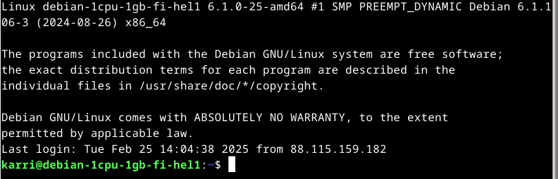

Heti ensimmäiseksi päivitän ohjelmat. 'sudo apt-get update' ja sitten potkaisen apachea että se on varmasti myös päivitetty. 'sudo systemctl restart apache2.

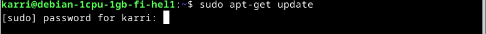  
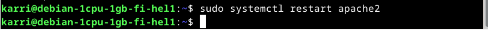

Katson että nettisivut toimivat.

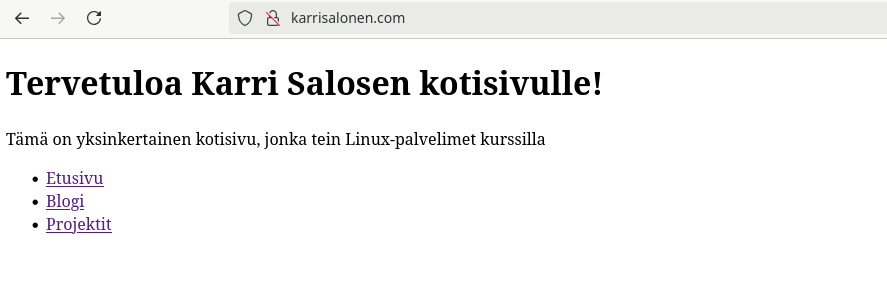

Domainnimen vieressä näkyy kaksi merkkiä ja 'viiva lukon päällä' merkki kertoo että yhteys ei ole suojattu.

Mennään apachen-hakemistoon. 'cd /etc/apache2/sites-available'

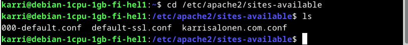

Tunnilla opettaja mainitsi että lego-työkalu on hyvä sertifikaatin hankkimiseen ja aikaisemmassa tehtävässä olevan Langen artikkelissa sitä on käytetty myös, joten hankitaan se. Minulla ei sitä vielä ole asennettu, joten etsin sen komennolla 'apt-cache search lego'

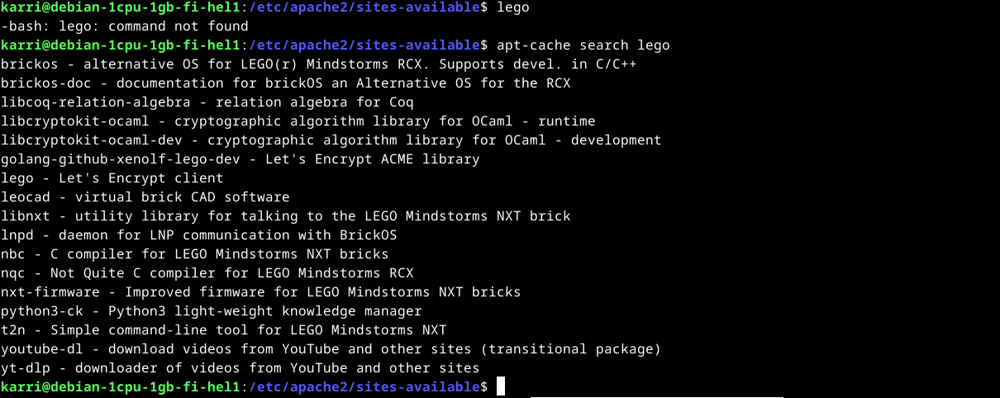  
ja sieltä se löytyy muiden ohjelmien joukosta helposti.

Asennetaan se komennolla 'sudo apt-get install lego'

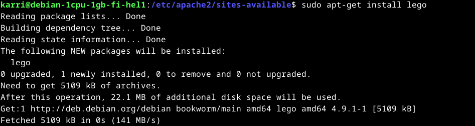

Hankitaan karrisalonen.com:lle sertifikaatti Let's Encryptistä lego-työkalun avulla. Komento kuvassa.

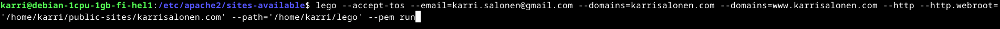  
Lego-komento, millä sertin saa.

Komento menee läpi ja sertifikaatti hankittu onnistuneesti.

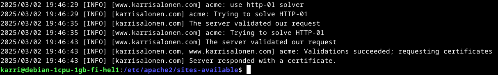

Käyn nopeasti tarkistamassa, mitä /home/karri/lego/certificates/ -hakemisto sisältää, jotta tiedän mitä sitten laittaa virtualhostin konfiguraatioon niin että salaus alkaa toimimaan palvelimellani. 'cd /home/karri/lego/' ja 'ls'.
Sen jälkeen vielä 'cd certificates' ja 'ls' ja 'find' niin näyttää helpommalta lukea mitä hakemistossa on. Find-komento kertoo mitä kaikki tiedostot hakemistossa.

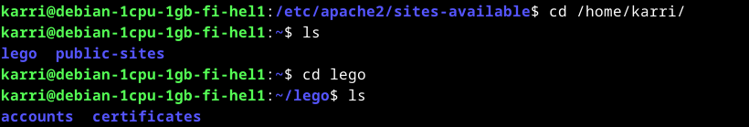  
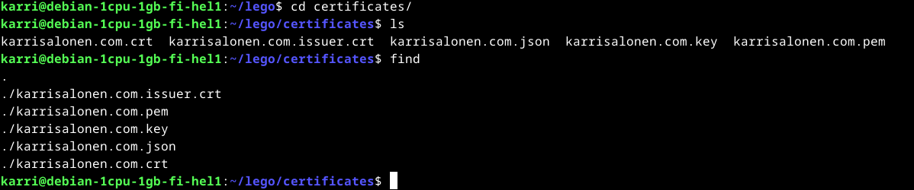

Mennään takaisin apache2/sites-available/ -hakemistoon. 'cd /etc/apache2/sites-available'.

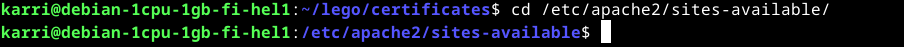

Muutetaan karrisalonen.com.conf -tiedoston tietoja. 'sudoedit karrisalonen.com.conf'.

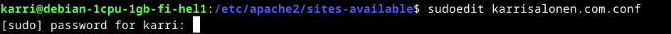

Copy virtualhost & paste sama teksti sen alle. Muutetaan siinä muutama asia. *:80 muutetaan *:443. Lisätään ServerAliaksen alle 'SSLEngine On', sen alle 'SSLCertificateFile /polku missä serti-tiedosto löytyy' ja sen alle vielä 'SSLCertificateKeyFile /polku'. Tarkemmin nämä näkyy kuvasta.

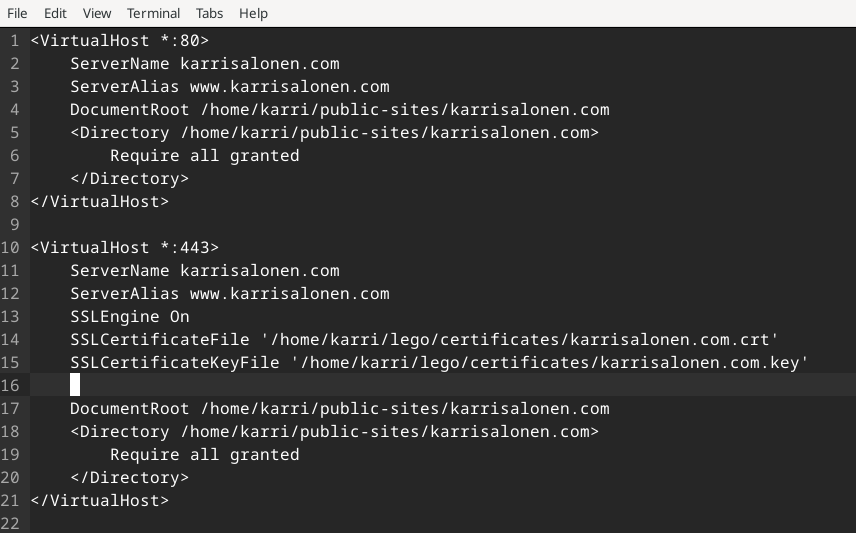  
Muutettu karrisalonen.com.conf -tiedosto.

Pistetään SSL -päälle. 'sudo a2enmod ssl'

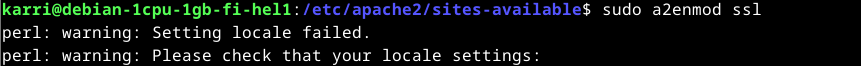

Potkaistaan apachea niin SSL alkaa toimimaan. 'sudo systemctl restart apache2'

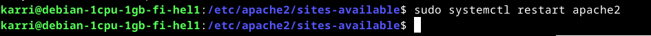

Tehdään vielä configtest niin nähdään että kaikki on kohdillaan. 'sudo apache2ctl configtest'

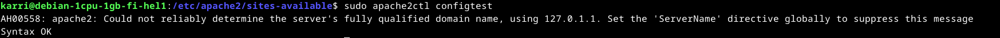  
Kaikki OK.

Tehdään vielä reikä palomuuriin. 'sudo ufw allow 443/tcp' ja testataan että se on kunnossa 'sudo ufw status verbose'.

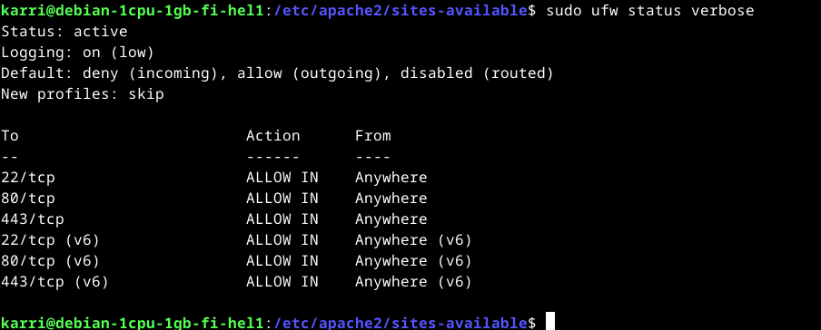  
Kaikki OK.

Lopuksi testataan että verkkosivun salaus toimii oikein. Menen Firefox-selaimeen ja oikealta yläkulmasta avaan 'Application menu' hampurilaisvalikon kuvasta. Sieltä valitsen 'Settings'. Sitten kohtaan 'Privacy & Security' ja rullaan kohtaan 'HTTPS-Only Mode.'
Valitsen kohdan 'Enable HTTPS-Only Mode in all windows' ja näin selain päivittää automaattisesti kaikki verkkosivut https-muotoon.

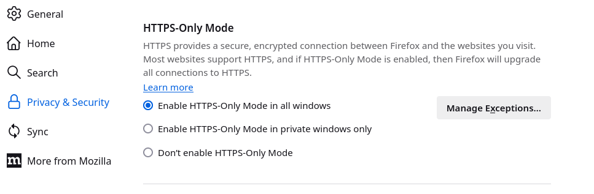

Testataan että salaus toimii sivulla karrisalonen.com.

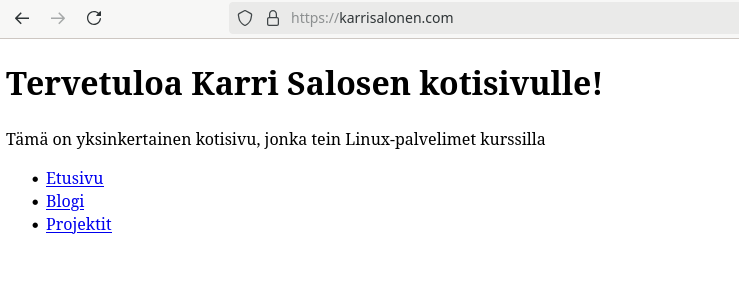  
Ja sehään toimii. Nyt sivu on salattu oikein.

Tehtävä valmis 19.55.

## b) A-rating

Tehtävän aloitus 22.15.

Käydään testaamassa kotisivuni karrisalonen.com TLS ja katsomassa saanko arvosanaksi A. Menen SSLLabs -sivulle (https://www.ssllabs.com/ssltest/) ja syötän hostnimeni karrisalonen.com 'Hostname' kohtaan. Sivusto alkaa tekemään testiä. Tässä menee muutama minuutti kun kaikki testit on tehty.

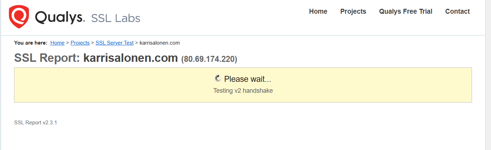  

Lopulta kun testi on valmis, saa sivustoni TLS arvosanaksi A. Hyvältä näyttää siis.

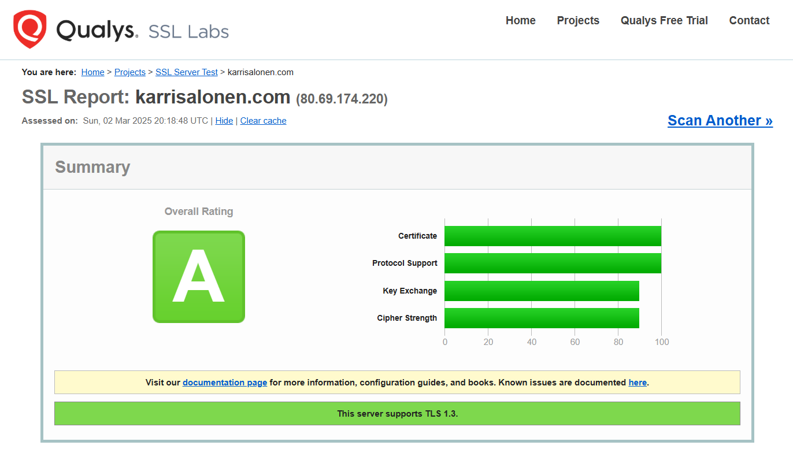

Tehtävä valmis 22.18.

## Lähteet:

Let's Encrypt. 2024. How It Works. https://letsencrypt.org/how-it-works/  
Lange. 2024. Lego: Obtain a Certificate: Using an existing, running web server. https://go-acme.github.io/lego/usage/cli/obtain-a-certificate/index.html#using-an-existing-running-web-server  
Apache Software Foundation. 2025. Apache HTTP Server Version 2.4 Official Documentation: SSL/TLS Strong Encryption: Hot-To: Basic Configuration Example. https://httpd.apache.org/docs/2.4/ssl/ssl_howto.html#configexample  
AskUbuntu. 2017. How can I disable and enable SSL in Apache (without a command if possible). https://askubuntu.com/questions/709594/how-can-i-disable-and-enable-ssl-in-apache-without-a-command-if-possible  
SSLLabs. 2025. SSL Server Test. https://www.ssllabs.com/ssltest/  
Tero Karvinen. 2025. Linux Palvelimet 2025 alkukevät. https://terokarvinen.com/linux-palvelimet/  
