# h7 Maalisuora

## Rauta

Lenovo 82SB  
AMD Ryzen 5 6600H with Radeon Graphics (12CPU)  
AMD RadeonT 660M  
NVIDIA GeForce RTX 3050 Ti Laptop GPU  
16 GB RAM  
Windows 11 Home 64-bit  

## Tehtävänanto

Tehtävä tehdään opettajan antamien ohjeiden (https://terokarvinen.com/linux-palvelimet/) mukaisesti kohdassa h7 Maalisuora 

## a) Hei Maailma

Asennan koneelle ruby- ja java-ohjelmat ja olen joskus aikaisemmin asentanut python3-ohjelman. Teen kaikilla kolmella ohjelmalla omat tiedostot käyttäen micro-editoria. Tiedostot ovat hello.rb, hello.java ja hello.py.
Kaikkiin tiedostoihin tein yksinkertaisen "Hei maailma" -komennon. Ruby ja java -komennot kopioin nopeasti netistä ja pythonin osasin itse tehdä. Kun tiedosto oli tehty ajoin ne läpi nähdäkseni että kaikki toimii.
Komennot olivat "ruby hello.rb", "java hello.java" ja "python3 hello.py". Kaikki kolme tekemääni hello-ohjelmaa toimivat oikein.

  
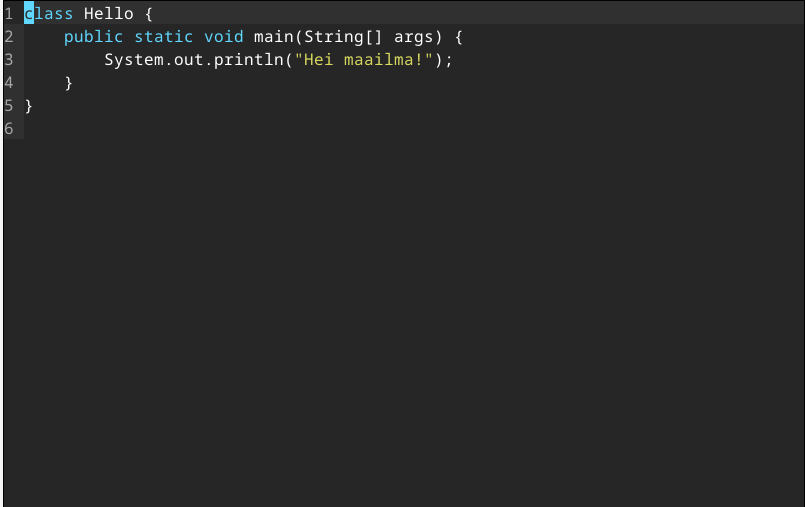  
  
  
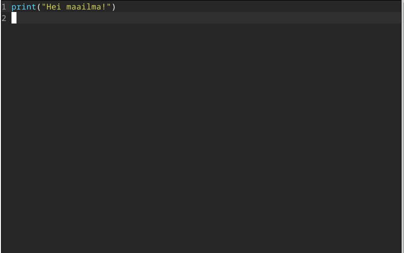  
  
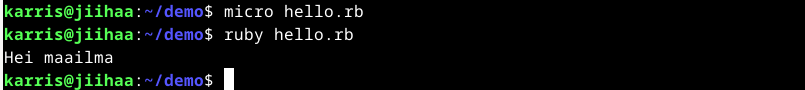  
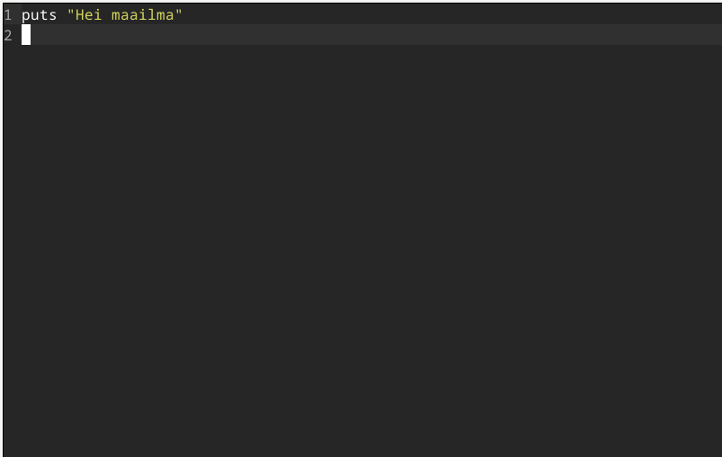  
 
## c) Uusi komento

Tein uuden komennon "omakomento". Olen aikasemmin tehnyt käyttäjälleni demo-hakemiston. Se sijaitsee /home/karris/demo/. Menen siihen komennolla "cd demo". Teen hakemistoon omakomento-tekstitiedoston komennolla "micro omakomento.sh".
Laitan komentoon tervehdyksen "Yo!" echo-komennolla, sitten cowsay waddap dawg, "echo ." kolme kertaa ja lopuksi cowthink okay ja whoami.

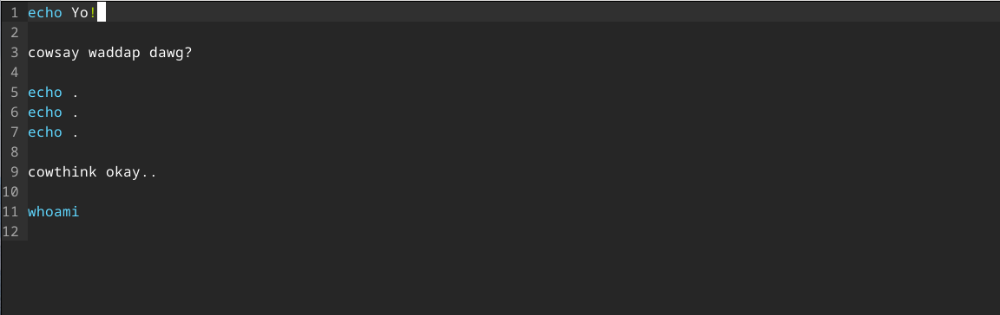  

Kun olen laittanut haluamani scriptin tiedostoon, tallennan sen ja poistun editorista. Muutan tiedoston nimen mukavampaan muotoon komennolla "mv omakomento.sh omakomento". Poistin siis loppu osan .sh. Sen jälkeen kopioin tiedoston hakemistoon /usr/local/bin, jotta kaikki käyttäjät voivat käyttää komentoa. Kopiointi onnistuu komennolla
"sudo cp -v howdy /usr/local/bin". Kun kopiointi on tehnyt annan kaikille käyttäjille vielä oikeudet tiedostoon, jotta kaikki voivat ajaa komennon. Se tapahtuu komennolla "sudo chmod ugo+x /usr/local/bin/omakomento".
Tämän tehtyäni testiajan komennon nähdäkseni että se varmasti toimii. Kaikki OK ja saan oikean vastauksen.

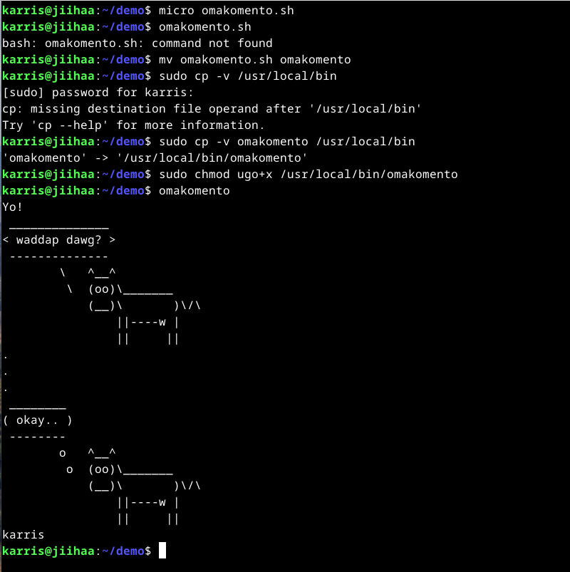 

## d) Vanhan labran ratkaiseminen

Googletin labroja haulla "tero karvinen labra" ja valitsin siitä heti ensimmäisen vaihtoehdon. Se oli "Final Lab for Linux Palvelimet 2024 Spring" (https://terokarvinen.com/2024/arvioitava-laboratorioharjoitus-2024-linux-palvelimet/). 
Teen d)- ja e)-kohdat kaikilta osin kuin pystyn. Joitain osia olen tehnyt jo aikaisemmin, joten niitä en tee nyt uudestaan.

### d) Howdy

Menen hakemistoon demo. Teen sinne tekstitiedoston howdy microeditorin avulla. Scriptiksi annan "Hei Maailma!" echo-komennolla, sitten haluan tietää IP-osoitteen, päivämäärän, kuka käyttäjä sen ajaa ja localhost etusivun koodin curl-komennolla. Tallennan ctrl-S ja poistun editorista crtl-Q.
Sitten kopioin tiedoston "sudo cp -v howdy /usr/local/bin" ja annan oikeudet tiedostoon "sudo chmod ugo+x /usr/local/bin/howdy". Sen jälkeen testiajan komennon. Kaikki toimii OK ja saan haluamani vastauksen.

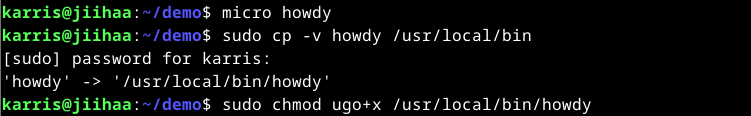  
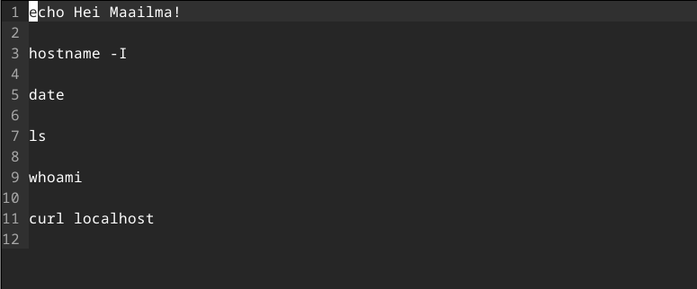  
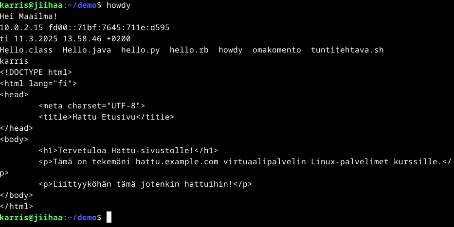  

### e) Etusivu uusiksi

Tehdään uusi etusivu yritykselle AI Kakone. Menen käyttäjäni public-sites -hakemistoon ja teen sinne uuden hakemiston "mkdir AI.kakone.com" ja siirryn tähän hakemistoon. Sinne teen tekstitiedoston index.html micro-editorilla.
Laitan tiedostoon etusivun HTML-koodin. Tallennan ja poistun editorista. Sen jälkeen siirryn hakemistoon /etc/apache2/sites-available. Kopioin sieltä hattu.example.com.conf -tiedoston tiedot (VirtualHost-konfiguroinnin) ja teen sudoedit komennolla
tiedoston AI.kakone.com.conf ja liitän sinne juuri kopioimani konfiguraation. Sitten muutan tarvitsemani tiedot oikeiksi, jotta kotisivu toimii oikein. Tallennan tiedoston. Kun tämä on tehty pistän sivun päälle "sudo a2ensite AI.kakone.com.conf", potkaisen apachea,
poistan "hattu.example.com" ja "karri.example.com" sivut käytöstä komennolla "sudo a2dissite" ja potkaisen apachea molempien pois päältä laittojen jälkeen. Sitten menen selaimessa localhost sivulle ja se on nyt päivittynyt uudeksi etusivuksi.

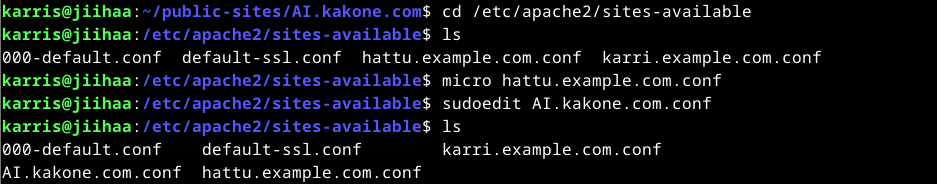  
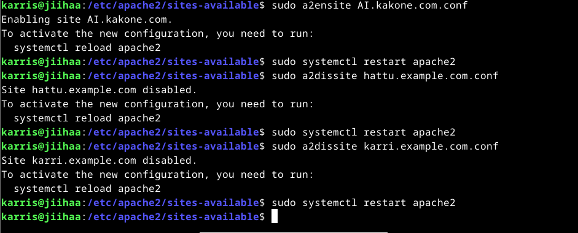  
  

## Lähteet:

Tero Karvinen. 2025. Linux palvelimet 2025 alkukevät. https://terokarvinen.com/linux-palvelimet/  
Tero Karvinen. 2024. Final Lab for Linux Palvelimet 2024 Spring. https://terokarvinen.com/2024/arvioitava-laboratorioharjoitus-2024-linux-palvelimet/  
Tero Karvinen. 2007. Shell Scripting. https://terokarvinen.com/2007/12/04/shell-scripting-4/  
Linuxiac. 2023. How to Install Java on Debian 12 (Bookworm). https://linuxiac.com/how-to-install-java-on-debian-12-bookworm/  
Linuxize. 2020. Hot to Install Ruby on Debian 10. https://linuxize.com/post/how-to-install-ruby-on-debian-10/  
Geeks for Geeks. 2019. Hello World in Ruby. https://www.geeksforgeeks.org/hello-world-in-ruby/  
Programiz. 2025. https://www.programiz.com/java-programming/hello-world  

